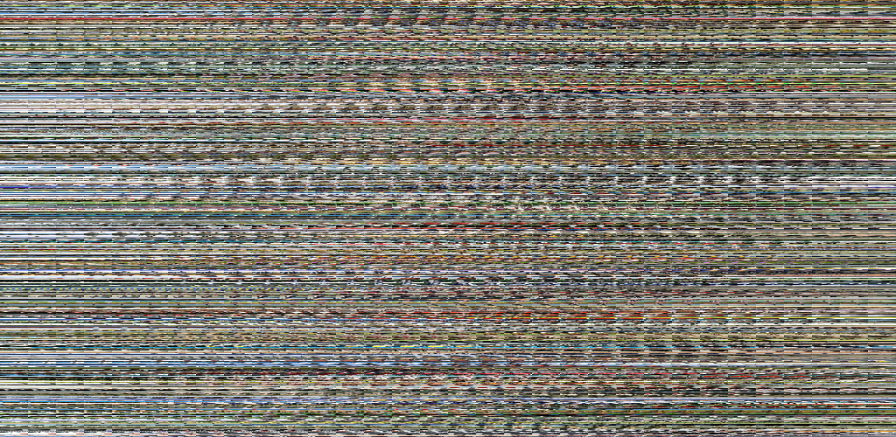

# Flat-and-Stack

A basic Python script to flatten some of the classic dataset images, stack them up, then save them as one big PNG. Mostly for easier loading of datasets for TensorflowJS models.

Usage:

```bash
python make_flat_dataset.py -d <{mnist, fashion, cifar10}> -k <Num Images> -n <Output File Prefix>
```


